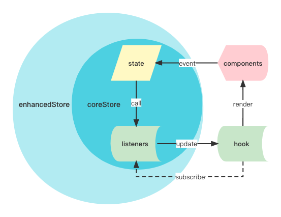

# 介绍

## nice-store 是什么

nice-store 是一个轻量的、灵活的、易扩展的状态管理工具，它不依赖任何其他的框架和库，它可以通过 hooks 很好地与 react 结合使用。

## 数据流

同 redux 类似，在 nice-store 中，数据流也是单向的。

- 先创建 store（可以增强 store），然后将 hook 的订阅函数添加到 store 的 listeners 中
- 组件的绑定事件触发时，调用 store 的 setState 函数，会更新 store 的 state
- 更新 state 之后，会调用 listeners 数组中的所有订阅函数
- 订阅函数的执行会更新 hook 的状态，之后触发组件的更新

## nice-store vs redux

nice-store 与 redux 的区别

- nice-store 的 store 个数可以根据需要创建多个，每个 store 都可以使用不同的[增强器](/zh-cn/enhancer)，而 redux 全局只有一个唯一的 store。
- nice-store 可以不使用 Provider、Context，也不用写 dispatch、action、reducer 等样板代码。

|            | nice-store | redux                                   |
| ---------- | ---------- | --------------------------------------- |
| size       | 2.9k       | redux 2.7k + react-redux 5.8k 至少 8.5k |
| store 个数 | 多个       | 一个                                    |
